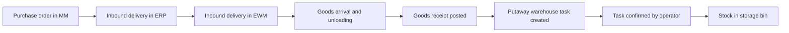

# Process Flow Diagrams

GitHub renders these Mermaid diagrams automatically. Replace or extend them with draw.io exports as the project grows.

## Inbound flow

```mermaid
flowchart LR
    A[Purchase order in MM] --> B[Inbound delivery in ERP]
    B --> C[Inbound delivery in EWM]
    C --> D[Goods arrival and unloading]
    D --> E[Goods receipt posted]
    E --> F[Putaway warehouse task created]
    F --> G[Task confirmed by operator]
    G --> H[Stock in storage bin]
```

## Outbound flow

```mermaid
flowchart LR
    A[Sales order in SD] --> B[Outbound delivery in ERP]
    B --> C[Outbound delivery order in EWM]
    C --> D[Wave release, optional]
    D --> E[Picking warehouse task]
    E --> F[Pick confirmed]
    F --> G[Packing and handling units]
    G --> H[Loading]
    H --> I[Goods issue posted]
```
